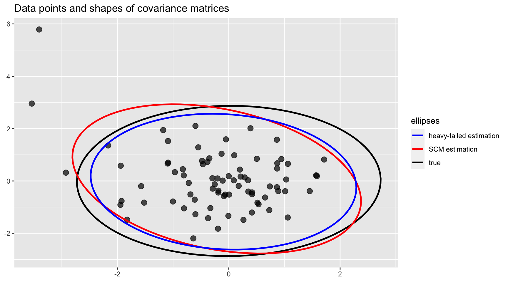

<!-- README.md is generated from README.Rmd. Please edit that file -->


# fitHeavyTail
[](https://CRAN.R-project.org/package=fitHeavyTail)
[](https://CRAN.R-project.org/package=fitHeavyTail)
[](https://CRAN.R-project.org/package=fitHeavyTail)

Robust estimation methods for the mean vector and covariance matrix 
from data (possibly containing NAs) under multivariate heavy-tailed 
distributions such as angular Gaussian, Cauchy, and Student's _t_. Additionally,
a factor model structure can be specified for the covariance matrix.
    

## Installation
The package can be installed from [CRAN](https://CRAN.R-project.org/package=fitHeavyTail) or [GitHub](https://github.com/dppalomar/fitHeavyTail):

```r
# install stable version from CRAN
install.packages("fitHeavyTail")

# install development version from GitHub
devtools::install_github("dppalomar/fitHeavyTail")
```

To get help:

```r
library(fitHeavyTail)
help(package = "fitHeavyTail")
?fit_mvt
```

To cite `fitHeavyTail` in publications:

```r
citation("fitHeavyTail")
```


## Quick Start
To illustrate the simple usage of the package `fitHeavyTail`, let's start by generating some multivariate data under a Student's _t_ distribution with significant heavy tails:

```r
library(mvtnorm)  # package for multivariate t distribution
N <- 10   # number of variables
T <- 80   # number of observations
nu <- 4   # degrees of freedom for tail heavyness

set.seed(42)
mu <- rep(0, N)
U <- t(rmvnorm(n = round(0.3*N), sigma = 0.1*diag(N)))
Sigma <- U %*% t(U) + diag(N)  # covariance matrix with factor model structure
Sigma_scatter <- (nu-2)/nu * Sigma
X <- rmvt(n = T, delta = mu, sigma = Sigma_scatter, df = nu)  # generate data
```

We can first estimate the mean vector and covariance matrix via the traditional sample estimates (i.e., sample mean and sample covariance matrix):

```r
mu_sm <- colMeans(X)
Sigma_scm <- cov(X)
```

Then we can compute the robust estimates via the package `fitHeavyTail`:

```r
library(fitHeavyTail)
fitted <- fit_mvt(X)
```

We can now compute the estimation errors and see the big improvement:

```r
sum((mu_sm - mu)^2)
#> [1] 0.2857323
sum((fitted$mu - mu)^2)
#> [1] 0.150424

sum((Sigma_scm - Sigma)^2)
#> [1] 5.861138
sum((fitted$cov - Sigma)^2)
#> [1] 2.957443
```

To get a visual idea of the robustness, we can plot the shapes of the covariance matrices (true and estimated ones) projected on two dimensions. Observe how the heavy-tailed estimation follows the true one more closely than the sample covariance matrix:




## Documentation
For more detailed information, please check the
[vignette](https://CRAN.R-project.org/package=fitHeavyTail/vignettes/CovarianceEstimationHeavyTail.html).


## Links
Package: [CRAN](https://CRAN.R-project.org/package=fitHeavyTail) and [GitHub](https://github.com/dppalomar/fitHeavyTail).

README file: [GitHub-readme](https://github.com/dppalomar/fitHeavyTail/blob/master/README.md).

Vignette: [CRAN-vignette](https://CRAN.R-project.org/package=fitHeavyTail/vignettes/CovarianceEstimationHeavyTail.html).
